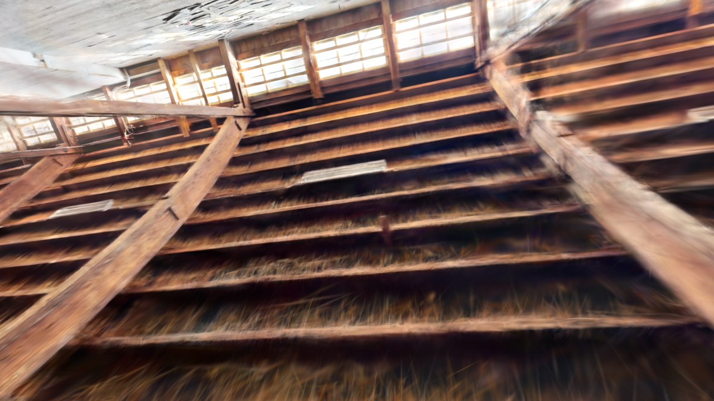
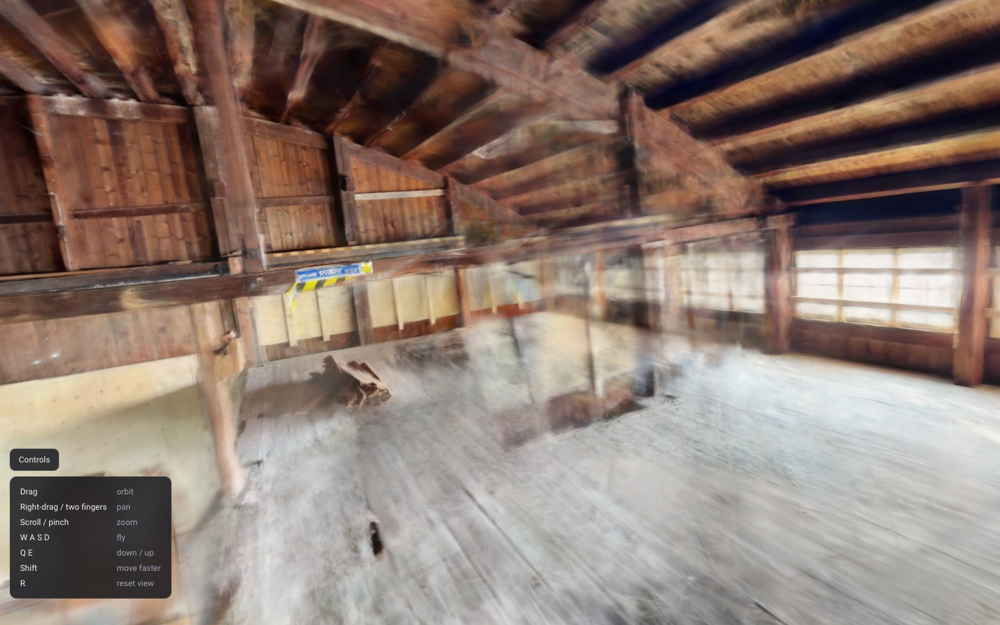

# Video → 3D Gaussian splat → browser viewer

Reconstruction of a large timber-framed warehouse interior from a single
handheld iPhone clip. Everything ran locally on an Apple M1 Max; nothing was
uploaded anywhere, and no CUDA-dependent tool was used.

```
./run.sh              # runs every stage that has not completed yet
./run.sh --list       # stage status
cd web && python3 -m http.server 8000   # then open http://localhost:8000
```

---

## Headline

| | |
|---|---|
| Source | 391.0 s, 1920×1080 (portrait after rotation), HEVC Main 10, HLG/BT.2020 HDR, 11,730 frames |
| Frames used | 1,200 selected from 11,730 (sharpest per time bucket) |
| Registered by COLMAP | **918 / 1200 (76.5%)**, 0.91 px mean reprojection error |
| Splats trained | **2,000,000** (MCMC cap reached), SH degree 3 |
| Wall clock | see [Timings](#timings) |

The Stage 2 registration checkpoint **did not pass** (76.5% registered against a
90% threshold, 8 components against a threshold of 1). The cause is motion blur
in the source footage, is diagnosed in detail below, and is not fixable
downstream. Training proceeded on the 918-image component because the operator
asked for the best result the material allows.

---

## Environment

Resolved versions are in `logs/env.txt`. Summary:

| | |
|---|---|
| Host | Apple M1 Max, 10 CPU cores, 32 GPU cores, 64 GB unified memory, macOS 15.7.4 |
| ffmpeg | 9.0.1 |
| COLMAP | 4.1.1 (no CUDA) |
| Brush | 0.3.0 — **prebuilt `aarch64-apple-darwin` release binary**, so no cargo build was needed |
| splat-transform | 2.7.1 |
| Python | 3.14.7 venv with numpy 2.5.2, opencv 5.0.0 |

Two flags in the task description are out of date, and both were caught by
running `--help` rather than trusting them:

* COLMAP 4.1.1 spells it **`--FeatureExtraction.use_gpu`**. The
  `--SiftExtraction.use_gpu` named in the brief no longer exists.
* splat-transform 2.7.1 spells `--info` as **`--summary`**.

---

## Stage 1 — Frames

`ffprobe` reported 391.01 s, 11,730 frames, constant 29.999 fps (not variable),
HEVC Main 10 `yuv420p10le`, and a `rotation=-90` side-data entry, so extracted
frames are **1080×1920 portrait**, not the 1920×1080 coded size.

### The footage is HDR, and that had to be handled

The clip is **HLG** (`arib-std-b67`) in **BT.2020**, i.e. iPhone HDR video, with a
Dolby Vision profile-8 RPU on an HLG-compatible base layer. Decoded as if it
were BT.709 it comes out flat and milky. This Homebrew ffmpeg has **neither
`zscale` nor `libplacebo`**, so there is no built-in path to tonemap it.

`scripts/hlg_tonemap.py` does the conversion instead: HLG inverse-OETF → scene
linear → HLG OOTF → BT.2020→BT.709 matrix → extended-Reinhard highlight rolloff
→ sRGB. ffmpeg pipes RGB48 into it and it writes the JPEGs. Side-by-side, the
tonemapped frames have visibly deeper contrast and correct wood tones.

### Frame selection: what the brief asked for, and what actually worked

The brief specifies a fixed extraction fps landing in the 400–800 window, then
dropping the blurriest ~15%. **That was implemented first and it failed** — see
[the Stage 2 diagnosis](#what-went-wrong-and-how-it-was-diagnosed). The footage is
handheld and frequently whipped around, so a fixed grid lands on a blurred frame
far too often, and no amount of culling afterwards can invent a sharp one.

The final pipeline instead:

1. Scores **every one of the 11,730 source frames** for variance-of-Laplacian, by
   piping 320-px grayscale frames out of ffmpeg. Takes **43 seconds**.
2. Splits the video into 1,200 equal buckets (9.8 source frames each) and takes
   the **sharpest frame in each bucket**.

This keeps the same average rate and the same coverage, but raises median
selected sharpness by **1.30×** over the fixed grid it replaces. It also
satisfies the brief's continuity requirement more strongly than asked: the rule
was "never drop more than one frame in any run of three", and here *every bucket
contributes exactly one frame*, so the sequence has no gaps at all.

Scores for all frames are in `logs/sharpness_allframes.csv`; the per-bucket
selection is in `logs/sharpness.csv`.

| | |
|---|---|
| Source frames scored | 11,730 |
| Frames selected | 1,200 (avg 3.07 fps) |
| Selected sharpness | median 317.2, mean 442.9 |
| Fixed grid would have given | median 243.8, mean 359.3 |
| Extraction + tonemap | 279 s → 455 MB |

### Sharpness is very unevenly distributed

Median variance-of-Laplacian per 20 s segment. The 20–60 s stretch is
effectively unusable, and it is exactly the part COLMAP could not register:

```
   0- 20s  197   ######
  20- 40s   99                <- camera whipped around; 1% of frames usable
  40- 60s   82                <- likewise, 2%
  60- 80s  266   ###############
  80-100s  544   ###########################
 100-140s  ~350  ####################
 140-160s  601   ############################
 160-240s  ~330  ##################
 240-340s  ~190  #########
 340-360s  280   ###############
 360-380s  188   ########
 380-400s  475   ##########################
```

---

## Stage 2 — Camera poses (COLMAP)

### Checkpoint result — FAILED

```
 input images:            1200
 registered:              918 (76.5%)   [threshold: >= 90%]   FAIL
 components:              8             [threshold: 1]        FAIL
 mean reprojection error: 0.912 px      [threshold: <= 1.5]   pass
```

The 8 components are not evenly split — one model holds **918** images and the
other seven hold 4–16 each (77 in total); 205 images registered nowhere. The
918-image model is what everything downstream uses.

### What went wrong, and how it was diagnosed

The first attempt followed the brief exactly: fixed-fps grid (700 frames at
1.79 fps), blurriest 15% dropped (595 kept), default SIFT, sequential matching,
exhaustive matching as loop closure. It registered **298/595 (50.1%)** across 4
components.

Rather than guess, the registered and unregistered frames were compared against
their own sharpness scores:

| | median variance-of-Laplacian |
|---|---|
| Frames COLMAP registered | **430** |
| Frames COLMAP could not register | **165** |

A 2.6× gap. Blur, not missing loop closure, was the primary cause — the
unregistered frames formed long contiguous blocks (12–95, 386–406, 412–451, …)
that line up with the low-sharpness segments in the table above.

The database told the rest of the story:

| | attempt 1 | attempt 2 | final |
|---|---|---|---|
| Frames | 595 (fps grid) | 1,200 (bucket max) | 1,200 (bucket max) |
| Keypoints / image | 3,532 | 7,722 | 7,722 |
| Matching | sequential + **exhaustive** | sequential only | sequential + **vocab-tree loop closure** |
| Pairs attempted | 176,715 | ~30,000 | ~70,000 |
| **Verified pairs** | 3,414 (1.9%) | 3,086 | **9,973** |
| Components | 4 | 17 | 8 |
| **Registered** | 298 (50.1%) | 132 (11.0%) | **918 (76.5%)** |

Two things this made clear:

* **Exhaustive matching was mostly wasted work.** 176,715 pairs, 21.5 minutes,
  and only 1.9% survived geometric verification. Features were the bottleneck,
  not the number of pairs tried.
* **But long-range pairs genuinely matter.** Attempt 2 dropped exhaustive
  matching for sequential-only and collapsed to 17 components. Long-range
  matches are not just about closing a loop at the end of the walk — they are
  what **bridges the blurred stretches**, by linking a section the camera rushed
  through to a later, sharper pass over the same part of the room.

So the final run spends its budget on richer features plus *targeted* long-range
matching, rather than on brute force:

* `--SiftExtraction.peak_threshold 0.004` (keeps weaker features, which is where
  blurred frames live), `--max_num_features 16384`, **DSP-SIFT**
  (`domain_size_pooling`) and `estimate_affine_shape` — both CPU-only in COLMAP,
  and together only ~0.6 s/image. Keypoints per image went **3,532 → 7,722**.
* `sequential_matcher` with overlap 25 + quadratic overlap for the local chain.
* `vocab_tree_matcher`, top-60 retrieval, for loop closure.

### The published COLMAP vocabulary trees do not work any more

COLMAP switched its vocabulary-tree format **from flann to faiss in May 2025**.
The trees still published on `demuc.de` are the old flann format and the matcher
does not degrade — it aborts:

```
Check failed: file_version == 1 || file_version == 2 Failed to read faiss index.
This may be caused by reading a legacy flann-based index, because COLMAP
switched from flann to faiss in May 2025.
```

No faiss-format tree is published anywhere, so Stage 2 **builds one from the
dataset's own descriptors**. Sizing matters a lot: 16,384 words over 1.5 M
descriptors ran for over 10 minutes with no progress output and no ETA and had
to be killed, while **4,096 words over 300,000 descriptors takes 1 m 44 s** and
works fine. Stage 0 no longer downloads the dead flann tree at all.

### GPU feature matching deadlocks on this machine

`--FeatureMatching.use_gpu 1` wedged permanently: 0% CPU, and `sample` showed the
process stuck inside `IOGPUCommandQueueSubmitCommandBuffers` with the matcher
worker blocked on its job queue. GPU *extraction* worked (29 s for 595 images),
but all matching is pinned to CPU. This is the "GPU SIFT is unreliable on macOS"
warning in the brief showing up on the matching side rather than extraction.

### A re-shoot would fix this

The reconstruction is limited by capture, not by processing. To get past 90%:

* **Move slowly and smoothly.** The single biggest win. The unregistered frames
  are the fast pans; 20–60 s of this clip has almost no usable frame in it.
* **Stop and rotate, don't rotate while walking.** Pure fast rotation gives large
  inter-frame baselines *and* blur at the same time.
* Shoot in bright light or lock a shorter shutter (1/120 or faster) to trade
  noise for sharpness — 3DGS tolerates noise far better than blur.
* Walk the space twice on overlapping paths, so every area gets a second, slower
  pass that loop closure can bind to.
* Avoid pointing straight into the windows; they blow out and take the
  surrounding wall with them.

---

## Stage 3 — Training (Brush)

Brush 0.3 trains **MCMC-style by default** — its changelog states it "now trains
using the MCMC splatting technique … You can set a limit of the maximum number
of splats like in the original MCMC" — so `--max-splats` *is* the MCMC cap and
there is no separate mode flag to set.

```
brush_app colmap/undistorted \
  --total-steps 30000 --max-splats 2000000 --max-resolution 1920 \
  --eval-split-every 8 --eval-every 5000 \
  --export-every 15000 --export-path splat --export-name 'export_{iter}.ply'
```

Brush emitted **no PSNR/SSIM lines** to stdout — its Rust stdout is block-buffered
when it is not attached to a TTY, and the metrics only ever appear in the
interactive UI. `--eval-split-every 8` was set, so an eval split was held out,
but no numeric quality metric is recoverable from a headless run. The rendered
still below is the honest substitute.

| | |
|---|---|
| Training images | 918 undistorted, 1080×1920 |
| Wall clock | **3,805 s (63 min)** for 30,000 steps |
| Splats | **2,000,000** — the MCMC cap was reached (already at 2 M by step 15,000) |
| SH degree | 3 |
| Output PLY | 450 MB |
| Peak resident memory | ~5.1 GB — no thrashing attributable to Brush |

Rendered directly from the trained splat with splat-transform's GPU rasterizer,
from the viewer's start pose:



The timber arch beams, purlins, clerestory glazing and light fittings all
reconstruct clearly. The smearing along the lower right is where the walkthrough
moved fastest, and the windows are blown out — both predicted.

---

## Stage 4 — Cleanup and compression

`splat-transform --summary` (2.7.1's name for the brief's `--info`) reported
**2,000,000 gaussians, 3 SH bands, 450 MB**.

### Floater crop

The crop box is derived with no hand-tuning, in `scripts/scene_info.py`: the AABB
of the 918 camera centres, inflated by **half its own diagonal on every side**
(the room is bigger than the walked path), then **unioned** with the 99.5th
percentile AABB of the 312,177 sparse points, so a wall COLMAP actually saw can
never be clipped away. The union only ever grows the box.

| | |
|---|---|
| Camera path AABB | 11.25 × 3.53 × 7.99, diagonal **14.24** |
| Inflation | 7.12 per side |
| Final box | 25.5 × 17.8 × 22.2 |
| Splats | 2,000,000 → **1,996,407** |
| **Removed** | **3,593 (0.18%)** |

The raw splat extends to ±50 on every axis — pure floaters, since the room is
about 14 m across. Cutting 0.18% is the right amount of conservative: it takes
the far-flung debris and touches nothing structural. Stage 4 also refuses to use
the crop at all if it would remove more than 40%, which would indicate the splat
was not in the COLMAP world frame.

### Compression

| | |
|---|---|
| PLY | 449 MB |
| **SOG** | **29.7 MB** |
| Ratio | **15.1×** |

Well under the 60 MB threshold, so a single `.sog` is used and **no streamed
multi-LOD build was needed**. That is the better outcome here anyway: Spark reads
`.sog` directly but does not read PlayCanvas's `lod-meta.json` streamed format,
so a streamed build would have forced a different renderer. GPU SOG compression
worked; the `-g cpu` fallback was not needed.

---

## Stage 5 — Viewer

Two viewers, fallback built first as instructed.

### `web-fallback/` — the safety net

`splat-transform final.ply web-fallback/index.html` produces a **44 MB
single-file** SuperSplat viewer with the splat embedded. Verified rendering in
the browser.

### `web/` — the real viewer

A single page built with Vite, using **`@sparkjsdev/spark` 2.1.0 on three.js
0.185.1**. Spark is a **WebGL2** renderer, so it works in Safari — this is not a
WebGPU-only build.

| | |
|---|---|
| `web/index.html` | 1.6 kB |
| `web/app/index.js` | 5.4 MB (three.js + Spark, bundled) |
| `web/app/index.css` | 2.4 kB |
| `web/assets/scene.sog` | 29.7 MB |
| `web/assets/poster.webp` | 786 kB |
| `web/assets/scene-info.json` | 838 B |
| **Total** | **36 MB** |

* **No CDN dependencies.** Everything is bundled or vendored. Stage 5 asserts
  this: it greps the built output for `src=`/`href=`/`fetch(`/`importScripts(`/
  `new Worker(`/`@import` pointing at an outside host and **fails the build** if
  any exist. (A naive grep for `https://` is not a valid test — three.js is full
  of XML namespace URIs handed to `createElementNS` and doc links in comments,
  none of which touch the network.) No analytics, no external calls.
* **Controls.** Drag to orbit, right-drag or two fingers to pan, scroll or pinch
  to zoom, **WASD to fly**, Q/E down/up, Shift to move faster, R to reset. Mouse,
  trackpad and touch all go through one Pointer Events path.
* **Loading indicator with real progress** — byte counts straight off the
  download, not a fake animation — over a **poster frame** rendered from the
  actual splat, so the page is never blank.
* **Background colour** is `CONFIG.backgroundColor` at the very top of
  `web-src/main.js`, in a `CONFIG` block holding every tunable.

### Framing is derived, not hand-set

The viewer would otherwise open pointing at nothing in particular. `scene_info.py`
derives from the COLMAP model:

* **World up**, from the mean camera-Y axis across all 918 poses — the scene is
  rotated so this lands on +Y and the horizon is level.
* **A start camera**, chosen from the real capture poses by **how open the view
  is**: for each pose it takes the median depth of the sparse points that pose
  observes, and picks the largest. The first implementation picked the
  geometrically central pose and opened the scene pressed against a roof beam;
  scoring by openness picks `00244.jpg`, median observed depth **15.2 m**, which
  looks down the length of the hall.

### Verified in the browser

Served with `python3 -m http.server` and driven headlessly:

* `.sog` loads and the scene renders — **6.6 s to first render, 60 fps**
* orbit, zoom, pan, WASD flight and R-to-reset all work
* console clean: no errors, no failed requests (one harmless
  `THREE.Clock is deprecated` warning from inside Spark)



---

## Timings

Wall clock for the final run, on an otherwise-busy M1 Max.

| Stage | Step | Time |
|---|---|---|
| 0 | Environment (COLMAP via brew, prebuilt Brush binary) | ~4 min |
| 1 | Sharpness scan of all 11,730 frames | 43 s |
| 1 | Extract + tonemap 1,200 frames | 279 s |
| 2 | Feature extraction, DSP-SIFT + affine (CPU) | ~10 min |
| 2 | Sequential matching (CPU) | ~7 min |
| 2 | Vocabulary tree build | 1 min 44 s |
| 2 | Vocabulary tree matching (CPU) | **32.8 min** |
| 2 | Mapper | **34.6 min** |
| 2 | Undistortion | 1.7 min |
| 3 | **Brush training, 30k steps, 2 M splats** | **63.4 min** |
| 4 | Crop + poster | 20 s |
| 4 | SOG compression | 2 min 39 s |
| 5 | Fallback single-file viewer | 2 min 40 s |
| 5 | Vite build | 1 s |
| | **Total (final run)** | **≈ 2 h 40 min** |

That excludes the two earlier full attempts at Stages 1–2 (roughly a further
2 h) that produced the diagnosis above.

### Artefact sizes

| | |
|---|---|
| Input video | 523 MB |
| 1,200 extracted frames | 455 MB |
| Undistorted image set (918) | 986 MB |
| Trained PLY | 450 MB |
| Cropped PLY | 449 MB |
| **`web/` (deployable)** | **36 MB** |
| `web-fallback/` | 42 MB |

---

## Known problems in this scene

Everything the brief predicted showed up:

* **Windows.** The warehouse is glazed along both long walls and the exterior is
  blown out in almost every frame. The glass reconstructs as a smear and takes
  some of the surrounding wall with it. Not fixable downstream.
* **Thin linear structures.** Roof ties, cables, railings and the timber bracing
  come out poorly; Gaussians represent thin geometry badly.
* **Blank surfaces.** The plank floor and the plain plastered sections have the
  fewest splats and the softest geometry, as expected.
* **Motion blur.** Dominant problem here, quantified above.
* The scene has two levels visible through floor openings, and the upper hall is
  reconstructed much better than the ground floor, which was walked faster.

## Machine-level notes

* The volume was **already 99% full** when this started — 14 GB free, none of it
  this project's doing — and macOS keeps its 26 swapfiles on the same volume.
  Free space reached 3.3 GB during training, so `colmap/database.db` (1.4 GB) was
  deleted; it is fully regenerable by re-running Stage 2, and Stage 2 was already
  complete. **If you want to re-run the mapper alone, Stage 2 must be re-run from
  feature extraction.** Everything else is intact.
* The machine was already using **24 GB of its 25.8 GB swap** before training
  began, from unrelated applications. Brush itself stayed at ~5 GB resident and
  did not appear to thrash, so the splat cap did not need reducing.
* `run.sh` stages are individually skippable via stamps in `.stamps/`. Within
  Stage 2, feature extraction / matching / mapping / undistortion each have their
  own marker, so a failure late in COLMAP never repeats the expensive earlier
  steps — which is exactly what made the three-attempt diagnosis affordable.
